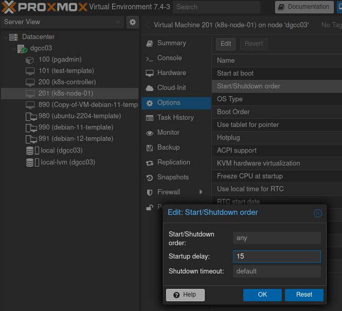

Table of Contents
- [Creating a Kubernetes Cluster](#creating-a-kubernetes-cluster)
  - [Previous steps (in case your are creating  it in a Proxmox Datacenter)](#previous-steps-in-case-your-are-creating--it-in-a-proxmox-datacenter)
  - [Dependencies (both controller and nodes)](#dependencies-both-controller-and-nodes)
    - [Update \& Upgrade](#update--upgrade)
    - [Installing a container runtime (containerd)](#installing-a-container-runtime-containerd)
    - [Disable Swap memory](#disable-swap-memory)
    - [Enablign Netfilter](#enablign-netfilter)
    - [Enabling IP Forward](#enabling-ip-forward)
    - [Reboot](#reboot)

## Creating a Kubernetes Cluster 

### Previous steps (in case your are creating  it in a Proxmox Datacenter)
1. Clone two VMs from Ubuntu Template (one for the controller and one for a node)

    Nodes

    k8s-controller
    Rol: control plane
    - 8 core
    - 8 GB RAM
    - 35 GB Disco

    k8s-node-01
    Rol: worker
    - 8 core
    - 8 GB RAM
    - 35 GB Disco

2. Add Startup delay to the nodes: 
Go to `Node VM->Options->Start/Shotdown order` and set `Startup delay` to 15 (seconds)


3. Start the VMs

### Dependencies (both controller and nodes) 

#### Update & Upgrade

SSH to the clusters nodes and:

```bash
sudo apt update && sudo apt dist-upgrade
```

#### Installing a container runtime (containerd) 

```bash
sudo apt install containerd -y
```
Cheking
```bash
systemctl status containerd
```
Creating `/etc/containerd` directory
```bash
sudo mkdir /etc/containerd
```
Creating default confiiguration to containerd
```bash
containerd config default | sudo tee /etc/containerd/config.toml
```
Change a setting in the previous file
```bash
sudo sed -i "s/SystemdCgroup = false/SystemdCgroup = true/g" /etc/containerd/config.toml
```

#### Disable Swap memory 
Ensuse that swap is disabled
```bash
free -m
```
Expexted Output:
```
                 total        used        free      shared  buff/cache  available 
Mem:            7964         106        7318           0         539        7778 
Swap:              0           0           0
```
If swap is not disabled, run:
```bash
sudo cp /etc/fstab /etc/fstab.bkp
sudo swapoff -a
sudo cat /etc/fstab | grep -v swap > /tmp/fstab
sudo cp /tmp/fstab /etc/fstab
```

#### Enablign Netfilter

Check if its enabled
```bash
sudo lsmod | grep br_netfilter
```
If not, run
```bash
sudo echo "br_netfilter" | sudo tee /etc/modules-load.d/k8s.conf
sudo echo "net.bridge.bridge-nf-call-ip6tables = 1" | sudo tee  /etc/sysctl.d/k8s.conf
sudo echo "net.bridge.bridge-nf-call-iptables = 1" | sudo tee -a /etc/sysctl.d/k8s.conf
sudo echo "net.bridge.bridge-nf-call-arptables = 1" | sudo tee -a /etc/sysctl.d/k8s.conf
```
Load systemctl
```bash
sudo sysctl --system
```

#### Enabling IP Forward

Setting `/proc/sys/net/ipv4/ip_forward` in 1
```bash
sudo sed -i "s/#net.ipv4.ip_forward=1/net.ipv4.ip_forward=1/g" /etc/sysctl.conf
sudo sysctl -p /etc/sysctl.conf
sudo /etc/init.d/procps restart
```

#### Reboot
```bash
sudo reboot
```