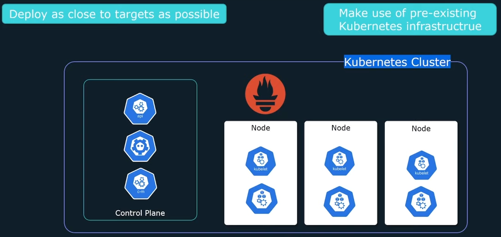

Table of Contents
- [Monitoring Kubernetes](#monitoring-kubernetes)
  - [Prometheus](#prometheus)
    - [Where to deploy](#where-to-deploy)
    - [What to monitor](#what-to-monitor)
    - [Service Discovery](#service-discovery)
    - [Deployment of Prometheus](#deployment-of-prometheus)

# Monitoring Kubernetes

## Prometheus

### Where to deploy

### What to monitor

- Monitor `applications` running on Kubernetes infrasteucture
- Monitor Kubernetes Cluster itself
  - Control-Plane Components (api-server, coredns, kube-scheduler)
  - Kubelet (cAdvisor) - exposing container metrics
  - Kube-state-metrics - cluster level metrics (deployments, pod)
  - Node-exporter - Run on all nodes for host related metrics (cpu, mem, network). Better option for this is to use a kubernetes daemonSet. 

### Service Discovery

Prometheus use `Service Discovery` to access to the `Kubernetes API` to discovery all the targets to monitor.

### Deployment of Prometheus

- Manually deploy: manually create all the `deployments, services, configMaps and secrets`. It is complex, requires a lot of configuration, not the easiest solution.
- Using a `Helm chart`

