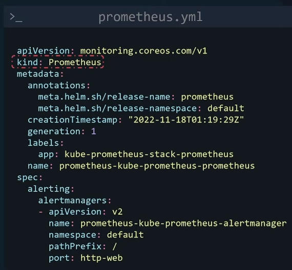

**MONITORING KUBERNETES**

Table of Contents
- [Prometheus](#prometheus)
  - [Where to deploy](#where-to-deploy)
  - [What to monitor](#what-to-monitor)
  - [Service Discovery](#service-discovery)
  - [Deployment of Prometheus options](#deployment-of-prometheus-options)
    - [Prometheus chart:](#prometheus-chart)
  - [Installing Prometheus Chart using Helm](#installing-prometheus-chart-using-helm)
  - [Exposing services trhoughout `port-forward`](#exposing-services-trhoughout-port-forward)
    - [Prometheus](#prometheus-1)
  - [Alertmanager](#alertmanager)
  - [Grafana](#grafana)

## Prometheus

### Where to deploy


### What to monitor

- Monitor `applications` running on Kubernetes infrasteucture
- Monitor Kubernetes Cluster itself
  - Control-Plane Components (api-server, coredns, kube-scheduler)
  - Kubelet (cAdvisor) - exposing container metrics
  - Kube-state-metrics - cluster level metrics (deployments, pod)
  - Node-exporter - Run on all nodes for host related metrics (cpu, mem, network). Better option for this is to use a kubernetes daemonSet. 

### Service Discovery

Prometheus use `Service Discovery` to access to the `Kubernetes API` to discovery all the targets to monitor.


### Deployment of Prometheus options

- Manually deploy: manually create all the `deployments, services, configMaps and secrets`. It is complex, requires a lot of configuration, not the easiest solution.
- Using a `Helm chart`: Helm is a package manager for Kubernetes: all applications and Kubernetes configs necessary for an application can be bundled into a package and easily deployed. 


- Helm Chart: is a collection of template & YAML files that convert into Kubernetes manifest files. 

#### Prometheus chart: 

https://github.com/prometheus-community/helm-charts/tree/main/charts/kube-prometheus-stack 

> Repository: prometheus-community <br>
> Chart: kube-prometheus-stack

- Prometheus Operator: The `kube-prometheus-stack` chart makes use of the `Prometheus Operator`. A Kubernetes `operator` is an application-specific controller that extends the K8s API to create/configure/manage instances of complex applications (like Prometheus).

Learn more: https://github.com/prometheus-operator/prometheus-operator

The `prometheus operator` has several custom resources extended from the Kubernetes API, such as:
- Prometheus
- Alertmanager
- ServiceMonitor
- Prometheus Rule
- Alertmanager Config
- PodMonitor
  


### Installing Prometheus Chart using Helm

Add repo
```bash
helm repo add prometheus-community https://prometheus-community.github.io/helm-charts
helm repo update
```

Create namespace
```bash
kubectl create ns monitor
```

Show configrable values
```bash
helm show values prometheus-community/kube-prometheus-stack > values.yaml
```

Install
```bash
helm install monitor prometheus-community/kube-prometheus-stack -n monitor -f values.yaml
```

### Exposing services trhoughout `port-forward`

#### Prometheus

```bash
kubectl port-forward svc/monitor-kube-prometheus-st-prometheus 9090:9090 -n monitor
```
ingresar a: http://127.0.0.1:9090

### Alertmanager

```bash
kubectl port-forward svc/monitor-kube-prometheus-st-alertmanager 9093 -n monitor
```
ingresar a: http://127.0.0.1:9093

### Grafana
```bash
kubectl port-forward svc/monitor-grafana 3000:80 -n monitor
```
ingresar a: http://127.0.0.1:3000